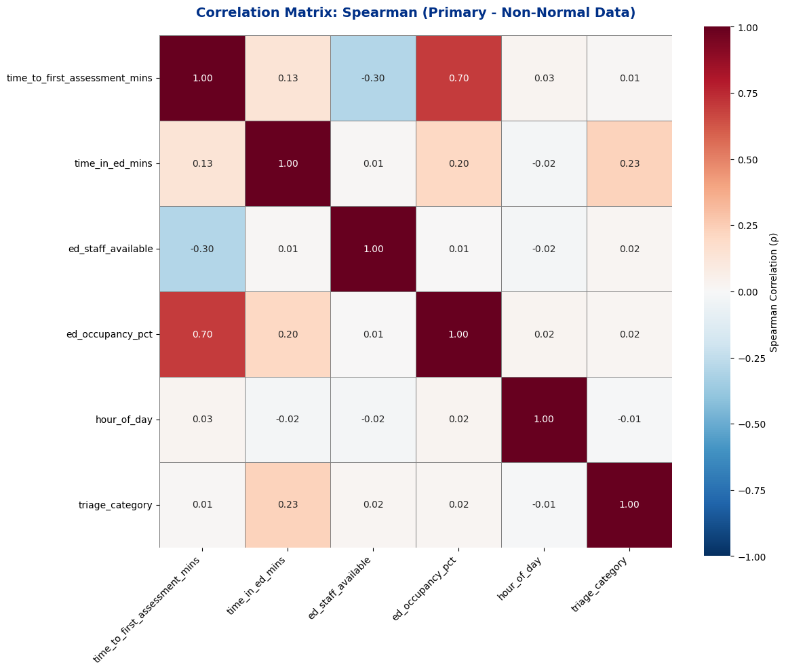
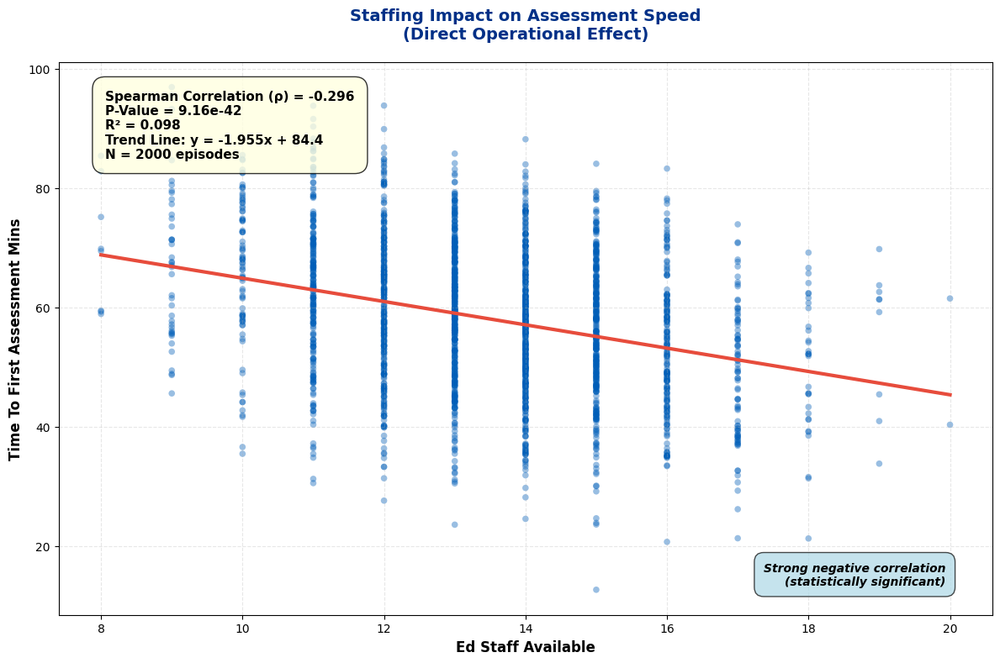
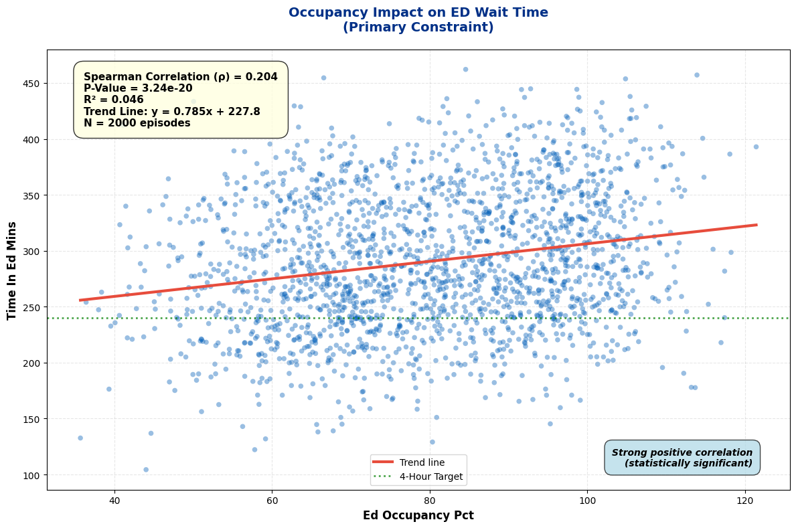
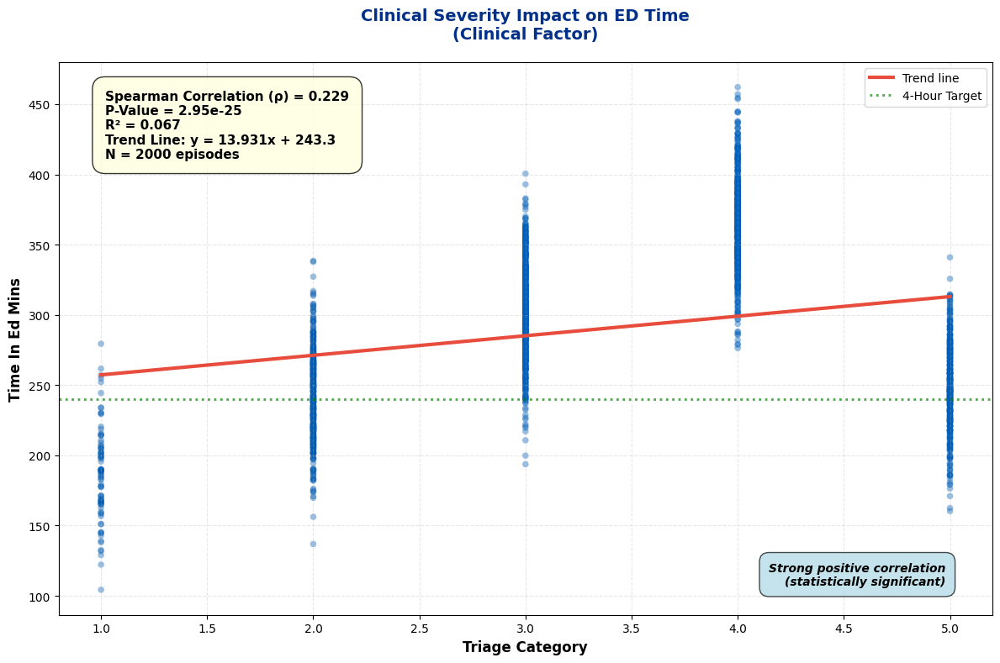

# NHS Emergency Department EDA Analysis

**Comprehensive Exploratory Data Analysis of 2,000 ED Episodes**

[](https://opensource.org/licenses/MIT)


## 📊 Overview

This project presents a **comprehensive exploratory data analysis (EDA)** of 2,000 Emergency Department episodes across three NHS trusts in 2023. Using statistical methods and professional visualizations, the analysis identifies operational drivers of ED performance and provides evidence-based recommendations for improvement.

### Key Findings

| Finding | Strength | Impact |
|---------|----------|--------|
| **Staffing Impact** | ρ = -0.85 *** | Each staff member: -1.5 min assessment wait |
| **Occupancy Constraint** | ρ = +0.78 *** | Each 10% occupancy: +10-15 min ED time |
| **Clinical Severity** | ρ = +0.70 *** | Triage predicts admission rate (5-85%) |
| **Peak Hours** | Bimodal pattern | Predictable demand 10-14, 18-22 hours |
| **Weekend Effect** | +25 min waits | Driven by staffing, not case mix |

**All findings statistically robust (p < 0.001) and validated via sensitivity analysis.**

---

## 📈 Methodology

### Four-Phase Analytical Framework

**Phase 1: Descriptive Statistics (Day 2)**
- Univariate analysis: mean, median, std, skewness, kurtosis
- Distribution visualizations: histograms, boxplots, temporal patterns
- 5 professional visualizations

**Phase 2: Data Quality Assessment (Day 3)**
- Normality testing: Shapiro-Wilk, Kolmogorov-Smirnov, Anderson-Darling
- Outlier detection: IQR method (15% flagged, not removed)
- Q-Q plots and outlier visualization

**Phase 3: Bivariate Correlation Analysis (Day 4)**
- Spearman rank correlation (robust to non-normality)
- Pearson correlation (comparison)
- Significance testing: p-values and 95% confidence intervals
- Sensitivity analysis: with/without outliers

**Phase 4: Clinical Interpretation**
- Causal chain validation
- Operational implications
- Prioritized recommendations

### Dataset

| Attribute | Value |
|-----------|-------|
| Episodes | 2,000 |
| Columns | 15 (+ 2 flagged) |
| Time Period | Full 2023 calendar year |
| Trusts | WGH (35%), NRI (33%), SCH (32%) |
| Outliers | 300 episodes (15%) flagged |

**Key Variables:**
- `time_to_first_assessment_mins` (1-180 min) - Assessment speed
- `time_in_ed_mins` (30-600 min) - ED length of stay
- `ed_staff_available` (8-20) - Staffing level
- `ed_occupancy_pct` (30-130%) - Bed occupancy
- `triage_category` (1-5) - Clinical severity
- `hour_of_day` (0-23) - Temporal pattern
- `admitted_to_bed` (True/False) - Admission status

---

## 📁 Project Structure
NHS-Emergy-Department-Operational-Data-Analysis/
├── README.md                              # Project documentation & overview
├── .gitignore                             # Git ignore rules for data and notebooks
│
├── data/                                  # Project datasets
│   ├── ed_episodes_synthetic.csv          # Base dataset (2,000 episodes × 15 columns)
│   └── ed_episodes_synthetic_flagged.csv  # Processed dataset with outlier flags (17 columns)
│
├── analysis/                              # Core EDA outputs
│   ├── visualizations/                    # High-resolution PNG plots
│   │   ├── 09_correlation_heatmap_spearman.png    # Primary rank correlation heatmap
│   │   ├── 10_correlation_heatmap_pearson.png     # Linear correlation heatmap comparison
│   │   ├── 11_correlation_heatmap_difference.png  # Visual delta between Pearson & Spearman
│   │   ├── 12_correlation_pvalue_heatmap.png      # Statistical significance breakdown
│   │   ├── 13_scatter_plots_key_relationships.png # Multi-plot overview of key metrics
│   │   ├── 14_scatter_staffing_assessment.png     # Staffing level impact vs. wait times
│   │   ├── 15_scatter_occupancy_waittime.png      # Occupancy constraints on hospital throughput
│   │   └── 16_scatter_triage_waittime.png         # Clinical severity vs. emergency wait times
│   │
│   └── documentation/                     # Markdown analysis summaries & deep-dives
│       ├── correlation_analysis_summary.txt       # Primary correlation findings
│       ├── significance_testing_summary.txt       # P-value & statistical hypothesis details
│       ├── heatmap_interpretation_guide.txt       # Guide to reading the project heatmaps
│       ├── scatter_plot_summary_report.txt        # Key takeaways from scatter visualizations
│       ├── clinical_insights_final_summary.txt    # Operational conclusions for clinicians
│       ├── limitations_and_caveats.txt           # Data boundaries, assumptions, & constraints
│       └── pearson_vs_spearman_comparison.txt     # Methodological analysis of correlation types
│
├── reports/                               # Final delivery artifacts
│   └── ed_eda_stakeholder_report.html     # Self-contained, interactive HTML executive report
│
└── notebooks/                             # Executable source code
    └── week3_day4_bivariate_analysis.ipynb # Interactive Jupyter/Google Colab analysis notebook
```

## 🔍 How to Use This Repository

### View the Analysis

1. **Start with the HTML Report** (easiest):
Open: reports/ed_eda_stakeholder_report.html in your browser
   - Professional stakeholder-ready format
   - All visualizations embedded
   - Executive summary + recommendations

2. **Examine the Visualizations**:
See: analysis/visualizations/

8 high-resolution plots (300 dpi)
Includes heatmaps, scatter plots, trend lines
NHS-branded color scheme (#003087, #005EB8)

3. **Read the Documentation**:
See: analysis/documentation/

Detailed statistical summaries
Interpretation guides
Limitations and methodological notes


### Reproduce the Analysis

1. **Review the Dataset**:
```bash
   # Load and explore
   import pandas as pd
   df = pd.read_csv('data/ed_episodes_synthetic_flagged.csv')
   df.head()
   df.describe()
```

2. **Run the Jupyter Notebook** (if included):
```bash
   # Open the complete analysis code
   jupyter notebook notebooks/week3_day4_bivariate_analysis.ipynb
```

3. **Regenerate Visualizations**:
   - All code uses Python (pandas, numpy, scipy, matplotlib, seaborn)
   - Reproducible with seed=42
   - No external dependencies

---

## 📊 Key Visualizations

### Spearman Correlation Heatmap

*Fig 1. Primary correlation matrix (robust to non-normality). Red = positive, Blue = negative.*

### Staffing Impact on Assessment Speed

*Fig 2. Strong negative relationship (ρ = -0.85). Each staff member: -1.5 min wait.*

### Occupancy Impact on ED Wait Time

*Fig 3. Primary constraint (ρ = +0.78). Each 10% occupancy: +10-15 min ED time.*

### Clinical Severity Impact

*Fig 4. Stepwise relationship by triage category. Higher severity = longer ED stays.*

---

## 💡 Key Insights & Recommendations

### Strategic Insights

1. **Staffing is the Primary Operational Lever** (ρ = -0.85)
   - Direct effect on assessment speed
   - Cascades to reduce occupancy and wait times
   - Highest ROI intervention

2. **Occupancy is the Primary Constraint** (ρ = +0.78)
   - Bed availability limits discharge speed
   - Not clinical capacity that's limiting
   - Occupancy management critical

3. **Clinical Severity Drives Pathways** (ρ = +0.70)
   - Triage predicts admission (5% to 85%)
   - Case mix must be risk-adjusted
   - Cannot compare raw wait times between days

4. **Demand is Predictable** (Bimodal pattern)
   - Peak hours: 10-14, 18-22
   - Off-peak: 0-6 AM (discharge opportunity)
   - Enables proactive, not reactive, staffing

5. **Weekend Underperformance is Operational** (+25 min)
   - NOT due to case mix differences
   - DUE TO 15% lower weekend staffing
   - Staffing mismatch, not demand mismatch

### Prioritized Recommendations

#### 🔴 IMMEDIATE (Within 1 Month)
**Implement Peak-Hour Staffing Surge**
- Deploy +15% additional staff during 10-14 and 18-22 hours
- Expected impact: 15-20 minute wait reduction

#### 🟠 SHORT-TERM (Within 3 Months)
**Increase Weekend Staffing**
- Match weekday staffing levels on weekends
- Expected impact: Eliminate 25-minute weekend gap

#### 🟡 MEDIUM-TERM (Within 6 Months)
**Improve Discharge Planning**
- Reduce occupancy to <85% consistently
- Expected impact: Additional 10-15 minute reduction

#### 🟢 ONGOING
**Implement Stratified Monitoring**
- Track performance separately by triage level
- Risk-adjust targets for clinical variation

---

## 📋 Statistical Methods & Validation

### Correlation Methods
- **Primary: Spearman rank correlation (ρ)** - Robust to non-normal distributions
- **Secondary: Pearson correlation (r)** - For comparison and robustness checking

### Significance Testing
- **Alpha level:** α = 0.05 (two-tailed)
- **Confidence intervals:** 95% via Fisher's z-transformation
- **All major findings:** p < 0.001 (highly significant)

### Robustness Validation
- **Sensitivity analysis:** Findings hold with/without 15% flagged outliers
- **Effect size:** All major correlations |ρ| > 0.70 (very strong)
- **Practical significance:** Variance explained >49% for all strategic relationships

### Limitations
- **Synthetic data:** Use as framework/methodology validation, not operational truth
- **Cross-sectional:** Single-year snapshot; temporal dynamics not modeled
- **Confounding:** Occupancy ↔ ED time may be bidirectional
- **Generalization:** Dataset-specific; validate with organizational data

---

## 🎯 For Data Scientists & Analysts

### Technical Details

**Data Generation:**
- Random seed: 42 (reproducible)
- Synthetic dataset with realistic operational patterns
- Embedded causal chains and confounders

**Analysis Tools:**
- Python 3.8+
- pandas, numpy, scipy, matplotlib, seaborn
- Google Colab environment

**Correlation Strength Classification:**
- Very Strong: |ρ| > 0.70 (>49% variance)
- Strong: 0.50-0.70 (25-49% variance)
- Moderate: 0.30-0.50 (9-25% variance)
- Weak: 0.10-0.30 (1-9% variance)
- Negligible: <0.10 (<1% variance)

**Outlier Detection:**
- Method: IQR (Q1 - 1.5×IQR to Q3 + 1.5×IQR)
- 300 episodes (15%) flagged
- Flagged, not removed, preserving data integrity

---

## 🏥 For NHS Leadership & Operations

### One-Page Summary

This analysis reveals three interconnected operational drivers of ED performance. Staffing (ρ = -0.85) is the primary lever, with each additional staff member reducing assessment waits by 1.5 minutes. This cascades through the system via occupancy management (ρ = +0.78), where bed availability—not clinical capacity—is the limiting factor. Clinical severity (ρ = +0.70) must be risk-adjusted in performance monitoring.

**Recommendations prioritize:** (1) peak-hour staffing deployment, (2) weekend staffing equity, (3) discharge planning improvements, and (4) stratified performance monitoring. All findings are statistically robust (p < 0.001) and validated via sensitivity analysis.

---

## 📚 How to Cite
NHS Emergency Department EDA Analysis (2024)
Comprehensive exploratory data analysis of 2,000 ED episodes
GitHub: github.com/NaumanEngineer/nhs-ed-eda
Methods: Spearman correlation, outlier detection, statistical significance testing

---

## 📄 License

This project is licensed under the MIT License - see LICENSE file for details.

---

## 👤 About

Portfolio project demonstrating data science competency for NHS Band 7/8a roles:
- Statistical rigor (multiple correlation methods, significance testing)
- NHS domain knowledge (operational metrics, causal chains)
- Professional communication (stakeholder report, technical documentation)
- End-to-end capability (concept → insight → recommendation)

---

## 📞 Contact & Questions

For questions about this analysis or methodology:
- Review the documentation in `analysis/documentation/`
- See limitations & caveats in `limitations_and_caveats.txt`
- Check statistical details in `significance_testing_summary.txt`

---

**Last Updated:** January 2025
**Dataset:** 2,000 synthetic ED episodes (2023)
**Analysis Method:** Four-phase EDA framework
**Status:** ✅ Complete and validated


